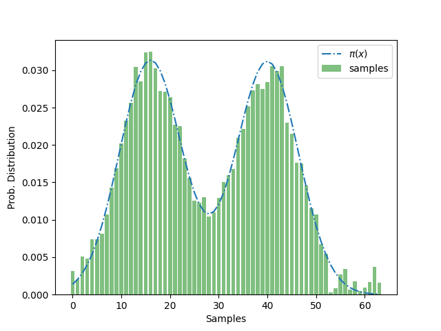

# Quantum Circuit Born Machine
(Implementation by: [Gopal Ramesh Dahale](https://github.com/Gopal-Dahale))

Quantum Circuit Born Machine (QCBM) [1] is a generative modeling algorithm which uses Born rule from quantum mechanics to sample from a quantum state $|\psi \rangle$ learned by training an ansatz $U(\theta)$ [1][2]. In this tutorial we show how `torchquantum` can be used to model a Gaussian mixture with QCBM.

## Setup

Below is the usage of `qcbm_gaussian_mixture.py` which can be obtained by running `python qcbm_gaussian_mixture.py -h`.

```
usage: qcbm_gaussian_mixture.py [-h] [--n_wires N_WIRES] [--epochs EPOCHS] [--n_blocks N_BLOCKS] [--n_layers_per_block N_LAYERS_PER_BLOCK] [--plot] [--optimizer OPTIMIZER] [--lr LR]

options:
  -h, --help            show this help message and exit
  --n_wires N_WIRES     Number of wires used in the circuit
  --epochs EPOCHS       Number of training epochs
  --n_blocks N_BLOCKS   Number of blocks in ansatz
  --n_layers_per_block N_LAYERS_PER_BLOCK
                        Number of layers per block in ansatz
  --plot                Visualize the predicted probability distribution
  --optimizer OPTIMIZER
                        optimizer class from torch.optim
  --lr LR
```

For example:

```
python qcbm_gaussian_mixture.py --plot --epochs 100 --optimizer RMSprop --lr 0.01 --n_blocks 6 --n_layers_per_block 2 --n_wires 6
```

Using the command above gives an output similar to the plot below.

<p align="center">

</p>


## References

1. Liu, Jin-Guo, and Lei Wang. “Differentiable learning of quantum circuit born machines.” Physical Review A 98.6 (2018): 062324.
2. Gili, Kaitlin, et al. "Do quantum circuit born machines generalize?." Quantum Science and Technology 8.3 (2023): 035021.