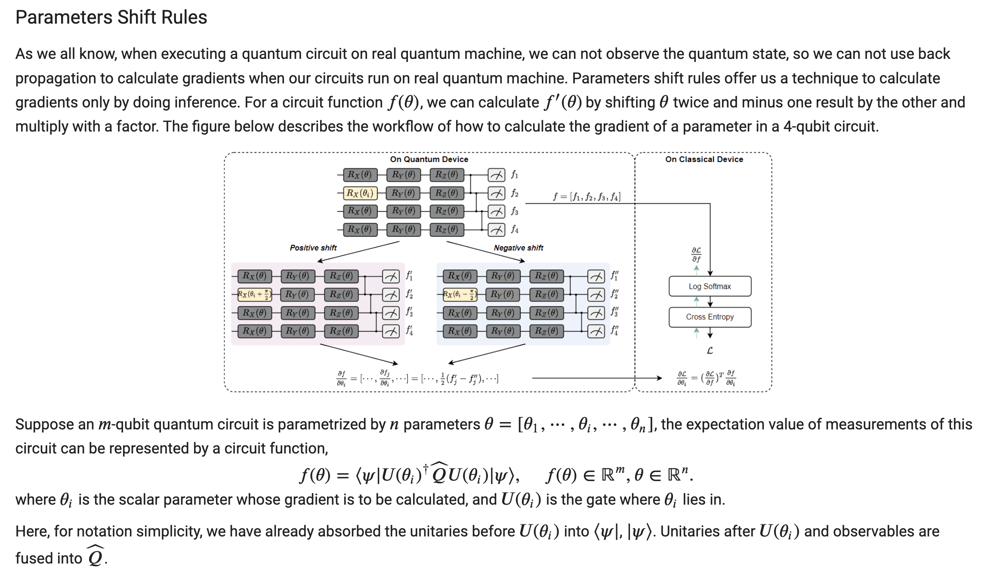
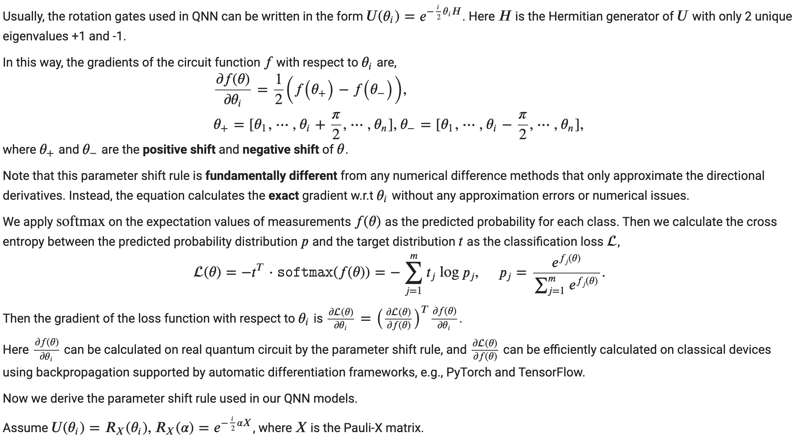

## On-chip Training of Quantum Neural Networks with parameter shift

Authors: Zirui Li, Hanrui Wang

Use Colab to run this example: 

Referece: [On-chip QNN: Towards Efficient On-Chip Training of Quantum Neural Networks
](https://qmlsys.mit.edu/publications/#onchipqnn)

[comment]: <> (#%% md)

### Outline
1. Introduction to Parameter-Shift Rules.
2. Train a model with parameter-shift rules.
3. A simple 2 qubit model for a simple 2 classification task.

[comment]: <> (#%% md)

## Introduction to Parameters Shift Rules

In this tutorial, you can learn parameters shift rules and how to use parameters shift rules to calculate gradients and use the gradient to train the model.

### Back Propagation

Previously, our quantum model was based on qiskit and pytorch. Once we did an inference of the model, pytorch will automatically build a computaional graph. We can calculate the gradients of each node in the computational graph in a reversed order based on the chain rule. This is called back propagation.

### Parameters Shift Rules

